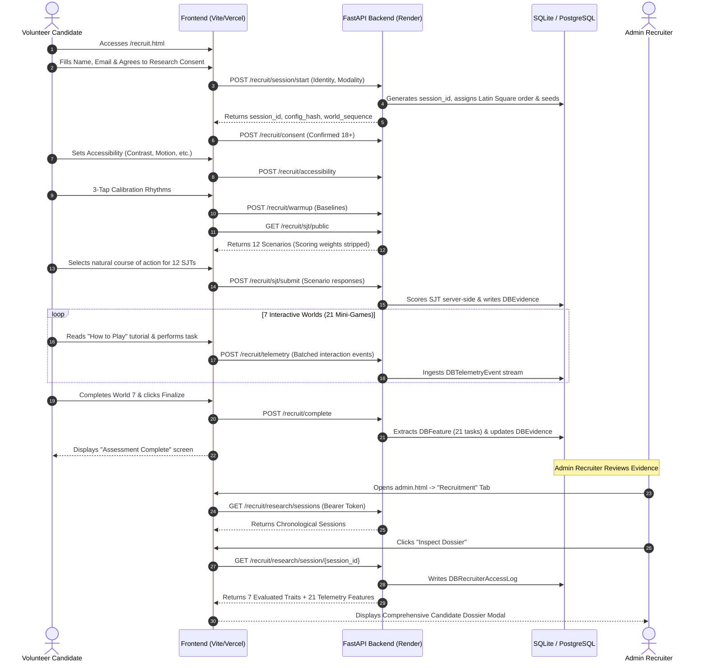

# Alfaaz Recruit — Technical Architecture & Integration Manual

> **Document Version:** 1.0.0 (October 2026)  
> **Status:** Production / Implemented  
> **Repository:** `alfaaz-project`  
> **Target Deployments:** FastAPI on Render (Backend) | Vite MPA on Vercel (Frontend)

---

## Table of Contents
1. [System Overview & Philosophical Context](#1-system-overview--philosophical-context)
2. [End-to-End Candidate & Recruiter Lifecycle](#2-end-to-end-candidate--recruiter-lifecycle)
3. [Construct Framework & The 7 Core Parameters](#3-construct-framework--the-7-core-parameters)
4. [Mathematical Models & Scoring Methodology](#4-mathematical-models--scoring-methodology)
   - [4.1 SJT Scoring & Ipsative Scaling](#41-sjt-scoring--ipsative-scaling)
   - [4.2 Latin Square World Counterbalancing](#42-latin-square-world-counterbalancing)
   - [4.3 Behavioral Feature Extraction (21 Mini-Games)](#43-behavioral-feature-extraction-21-mini-games)
   - [4.4 Evidence Integration & Confidence Grading](#44-evidence-integration--confidence-grading)
5. [Frontend Architecture & Implementation](#5-frontend-architecture--implementation)
   - [5.1 Multi-Page App (MPA) Flow & State Management](#51-multi-page-app-mpa-flow--state-management)
   - [5.2 Content Security, Anti-Copy & Anti-Screenshot Protections](#52-content-security-anti-copy--anti-screenshot-protections)
   - [5.3 Poetic Metaphors & Interactive "How to Play" Cards](#53-poetic-metaphors--interactive-how-to-play-cards)
   - [5.4 Telemetry Buffering, Flushing & Beacon Fallbacks](#54-telemetry-buffering-flushing--beacon-fallbacks)
6. [Backend Services & API Architecture](#6-backend-services--api-architecture)
   - [6.1 Service Layer Breakdown](#61-service-layer-breakdown)
   - [6.2 API Endpoint Directory](#62-api-endpoint-directory)
   - [6.3 Cross-Platform Integrity & SHA-256 Config Validation](#63-cross-platform-integrity--sha-256-config-validation)
7. [Database Schema & Identity Isolation](#7-database-schema--identity-isolation)
8. [Admin Panel Involvement & Candidate Dossier](#8-admin-panel-involvement--candidate-dossier)
   - [8.1 Chronological Candidate Ledger](#81-chronological-candidate-ledger)
   - [8.2 Detailed Evidence Dossier Modal](#82-detailed-evidence-dossier-modal)
   - [8.3 Recruiter Access Audit Trail](#83-recruiter-access-audit-trail)
9. [Privacy, Ethics & DPDP Act Compliance](#9-privacy-ethics--dpdp-act-compliance)
10. [Verification, Unit Tests & Deployment](#10-verification-unit-tests--deployment)

---

## 1. System Overview & Philosophical Context

**Alfaaz Recruit** is an exploratory, research-grade assessment instrument engineered for the **Alfaaz Collective** to welcome and evaluate community volunteers across cultural, artistic, and literary initiatives.

### Core Architectural Values:
- **Total Minimalism & High Typography:** Retaining Alfaaz Collective's aesthetic identity (warm terracotta, stone parchment, gold accents, and bilingual English/Urdu cultural touches).
- **Non-Evaluative & Growth-Oriented:** The candidate experience avoids harsh right/wrong tests or red/green score displays. It presents natural workplace situations and creative crafting tasks.
- **Strict Identity Isolation:** Identifying details (name, email) are kept separate from behavioral telemetry events, which use a pseudonymous UUID session key.
- **Deterministic & Auditable:** All scores and extracted features are 100% deterministic, byte-for-byte reproducible, and free from non-deterministic generative LLM grading.

```
+-----------------------------------------------------------------------------------------+
|                                     ALFAAZ RECRUIT                                      |
+-----------------------------------------------------------------------------------------+
|                                                                                         |
|   [ CANDIDATE JOURNEY ]                                [ ADMIN RESEARCH DOSSIER ]       |
|                                                                                         |
|   1. Consent & Privacy (DPDP Notice)                   1. Chronological Session Ledger  |
|   2. Accessibility Preferences                         2. Evaluated Traits (7 Bands)    |
|   3. Interactive Baseline Calibration                  3. 21-Task Behavioral Table      |
|   4. 12 Situational Scenarios (SJT)                    4. Data Quality & Gap Notices    |
|   5. 7 Balanced Interactive Worlds (21 Mini-Games)     5. Immutable Recruiter Log       |
|   6. Telemetry Ingest & Synchronization                                                 |
|                                                                                         |
+-----------------------------------------------------------------------------------------+
```

---

## 2. End-to-End Candidate & Recruiter Lifecycle



---

## 3. Construct Framework & The 7 Core Parameters

The assessment measures 7 dimensions critical to community stewardship and creative collaboration:

| Parameter Key | Public/Thematic Name | Construct Definition |
| :--- | :--- | :--- |
| `empathy` | **Empathy & Active Listening** | Attunement to subtle acoustic, verbal, and emotional cues; prioritizing relational warmth and listening before acting. |
| `conscientiousness` | **Conscientiousness & Care** | Detail orientation, rule adherence in historical preservation, and active verification of shared artifacts. |
| `collaborative_spirit` | **Collaborative Spirit** | Resource-sharing without friction, balanced coordination, and supportive space-making with peer artisans. |
| `emotional_agility` | **Emotional Agility & Resilience** | Graceful adaptation to shifting guidelines, unexpected interruptions, and unpredicted courtyard circumstances. |
| `curiosity` | **Intellectual & Cultural Curiosity** | Willingness to explore optional historical alcoves, delve into archival provenance, and seek cross-disciplinary crafts. |
| `creative_initiative` | **Creative Initiative & Improvisation** | Overcoming functional fixedness, repurposing available workshop materials, and proposing elegant spatial designs. |
| `motivation` | **Intrinsic Motivation & Dedication** | Persistence in essential ceremonial duties, sustained rhythm under routine tasks, and optional community service. |

---

## 4. Mathematical Models & Scoring Methodology

### 4.1 SJT Scoring & Ipsative Scaling
The Situational Judgment Test (SJT) consists of 12 multi-faceted scenarios across 4 acts. Every scenario offers 4 options ($A, B, C, D$).

#### Scoring Rules:
1. Each option distributes fractional integer points ($0, 1, 2, 3$) across the relevant parameters:
   $$\text{Raw Score}(P) = \sum_{s \in \text{Responses}} w(s, \text{choice}, P)$$
2. **Ipsative Nature:** Because choices force trade-offs between parameters (e.g. choosing deep archival verification vs. immediate collaborative speed), high scores in one trait naturally balance others.
3. **Band Cutoffs:** Raw scores are mapped onto 3 standardized research bands:

| Band | Percentage Span Cutoff | Interpretation Note |
| :--- | :--- | :--- |
| **LOW** | $\le 33.33\%$ of Span | Lower relative emphasis in this scenario trade-off. |
| **MODERATE** | $> 33.33\%$ and $\le 66.66\%$ of Span | Balanced, flexible application across contexts. |
| **HIGH** | $> 66.66\%$ of Span | High natural prioritization of this behavioral impulse. |

#### Random Responder Baseline Reference:
Theoretical distribution of a random agent choosing uniformly at random ($p = 0.25$ per option):

```
Empathy:             LOW: 34.6%  |  MODERATE: 59.7%  |  HIGH: 5.7%
Conscientiousness:   LOW: 46.0%  |  MODERATE: 51.1%  |  HIGH: 2.9%
Collaborative Spirit:LOW: 34.2%  |  MODERATE: 60.9%  |  HIGH: 5.0%
Emotional Agility:   LOW: 43.9%  |  MODERATE: 51.9%  |  HIGH: 4.2%
Curiosity:           LOW: 48.2%  |  MODERATE: 49.2%  |  HIGH: 2.5%
Creative Initiative: LOW: 48.9%  |  MODERATE: 48.9%  |  HIGH: 2.2%
Motivation:          LOW: 34.7%  |  MODERATE: 59.6%  |  HIGH: 5.7%
```

---

### 4.2 Latin Square World Counterbalancing
To eliminate presentation order bias and fatigue effects across the 7 interactive worlds, sessions are counterbalanced using a **14-row first-order balanced Latin Square**:

$$\begin{matrix}
\text{Row 0:} & [W_1, W_2, W_7, W_3, W_6, W_4, W_5] \\
\text{Row 1:} & [W_2, W_3, W_1, W_4, W_7, W_5, W_6] \\
\text{Row 2:} & [W_3, W_4, W_2, W_5, W_1, W_6, W_7] \\
\text{Row 3:} & [W_4, W_5, W_3, W_6, W_2, W_7, W_1] \\
\text{Row 4:} & [W_5, W_6, W_4, W_7, W_3, W_1, W_2] \\
\text{Row 5:} & [W_6, W_7, W_5, W_1, W_4, W_2, W_3] \\
\text{Row 6:} & [W_7, W_1, W_6, W_2, W_5, W_3, W_4] \\
\text{Rows 7--13:} & \text{Reverse balance permutations of rows 0--6}
\end{matrix}$$

*Assignment Algorithm:* On `POST /recruit/session/start`, the server selects the **least-used Latin square row** across existing sessions, ensuring uniform sample distribution.

---

### 4.3 Behavioral Feature Extraction (21 Mini-Games)

The battery comprises 7 worlds $\times$ 3 mini-games = **21 distinct behavioral micro-tasks**. Features are extracted deterministically by `feature_extractor.py`:

```
+----------------------------------------------------------------------------------------------------------+
| WORLD / CONSTRUCT         | MINI-GAME & TASK TITLE             | EXTRACTED FEATURE KEY                   |
+---------------------------+------------------------------------+-----------------------------------------+
| W1: The Soundscape        | F1: Tuning the Hall                | cue_response_latency_ms                 |
| (Empathy)                 | F2: The Gathering Voices           | clarification_vs_assumption_ratio       |
|                           | F3: The Echo of the Room           | post_shift_adaptation_latency_ms        |
+---------------------------+------------------------------------+-----------------------------------------+
| W2: The Living Archive    | A1: The Manuscript Folios          | classification_rule_adherence_rate      |
| (Conscientiousness)       | A2: The Fragile Leaf               | exception_flagging_precision            |
|                           | A3: The Exhibition Ledger          | error_detection_sensitivity             |
+---------------------------+------------------------------------+-----------------------------------------+
| W3: The Shared Canvas     | C1: The Artisan's Basket           | need_sensitive_sharing_index            |
| (Collaborative Spirit)    | C2: The Gallery Wall               | coordination_collision_avoidance_rate   |
|                           | C3: The Dual Lanterns              | constructive_repair_score               |
+---------------------------+------------------------------------+-----------------------------------------+
| W4: The Shifting Patterns | E1: The Ceramic Mosaic             | perseverative_error_count               |
| (Emotional Agility)       | E2: The Unexpected Guest           | cadence_stability_ratio                 |
|                           | E3: The Geometric Harmony          | strategy_shift_efficiency               |
+---------------------------+------------------------------------+-----------------------------------------+
| W5: The Hidden Courtyard  | Q1: The Three Chambers             | optional_alcove_exploration_rate        |
| (Curiosity)               | Q2: The Uncataloged Seal           | anomaly_investigation_depth             |
|                           | Q3: The Weaver's Chronicle         | integrated_insight_utilization          |
+---------------------------+------------------------------------+-----------------------------------------+
| W6: The Workshop Bench    | CR1: The Artisan's Cord            | solution_uniqueness_index               |
| (Creative Initiative)     | CR2: The Central Pillar            | creative_pivot_latency_ms               |
|                           | CR3: The Printed Motif             | functional_fixedness_overcome_rate      |
+---------------------------+------------------------------------+-----------------------------------------+
| W7: The Final Gathering   | M1: The Wax Seal                   | mandatory_cadence_consistency           |
| (Motivation)              | M2: The Courtesy Sleeves           | optional_units_completed                |
|                           | M3: The Evening Threshold          | reduced_feedback_persistence_count      |
+---------------------------+------------------------------------+-----------------------------------------+
```

---

### 4.4 Evidence Integration & Confidence Grading

When `integrate_session_evidence()` executes, each parameter synthesizes both SJT scores and mini-game behavioral observations:

1. **Usable Games Calculation:** For parameter $P$ associated with mini-games $\{M_1, M_2, M_3\}$, count $k = \sum \mathbb{I}(\text{all features valid in } M_i)$.
2. **Confidence Metric:**
   - $k \le 1$ or critical quality flag present $\implies \text{Confidence} = \mathbf{LIMITED}$
   - $k = 2 \implies \text{Confidence} = \mathbf{MODERATE}$
   - $k = 3 \implies \text{Confidence} = \mathbf{SUBSTANTIAL}$
3. **Relationship Classification:**
   - SJT completed & $k > 0 \implies \mathbf{ALIGNED}$
   - SJT completed & $k = 0 \implies \mathbf{SJT\_ONLY}$
   - SJT missing & $k > 0 \implies \mathbf{GAME\_ONLY}$

---

## 5. Frontend Architecture & Implementation

### 5.1 Multi-Page App (MPA) Flow & State Management
Implemented with vanilla ES modules inside Vite (`frontend/src/recruit.js`):

```
[ Consent Screen ] 
       │
       ▼
[ Accessibility Options ] 
       │
       ▼
[ Interactive Calibration / Warm-up ] 
       │
       ▼
[ 12 SJT Scenarios ] 
       │
       ▼
[ 7-World Game Battery (21 Mini-Games) ] 
       │
       ▼
[ "Finalizing..." Telemetry Sync ] 
       │
       ▼
[ Assessment Complete Screen ]
```

---

### 5.2 Content Security, Anti-Copy & Anti-Screenshot Protections
To prevent test compromise, content sharing, and leakage:
1. **Selection & Print Blocking (`recruit.html`):**
   ```css
   -webkit-user-select: none !important;
   user-select: none !important;
   @media print { body { display: none !important; } }
   ```
2. **Event Interceptions (`recruit.js`):**
   - Blocks `contextmenu` (Right Click).
   - Blocks `copy`, `cut`, and `dragstart`.
   - Intercepts keyboard shortcuts: `Ctrl+C`, `Ctrl+P`, `Ctrl+S`, `Ctrl+U`, `PrintScreen`.
   - Overwrites system clipboard on screenshot triggers (`navigator.clipboard.writeText('')`).

---

### 5.3 Poetic Metaphors & Interactive "How to Play" Cards
- **Trait-Masked Titles:** Obvious construct names (e.g. "Rule Switching Task") are replaced with grounded metaphors (*The Ceramic Mosaic*).
- **Activity Guides (طریقہ کار):** Every mini-game renders a reusable `renderTutorialCard()` detailing:
  1. Cultural context & poetic purpose.
  2. 3 simple step-by-step instructions.
  3. Visual badge and "Begin Activity" activation button.

---

### 5.4 Telemetry Buffering, Flushing & Beacon Fallbacks
- Events are buffered into `state.telemetryQueue`.
- Automatic flush executes on:
  - Batch size $\ge 10$ events.
  - End of a mini-game (`minigame_end`).
  - End of SJT (`sjt_complete`).
  - Browser tab closure via `navigator.sendBeacon('/recruit/telemetry', payload)`.

---

## 6. Backend Services & API Architecture

### 6.1 Service Layer Breakdown
Located under `backend/app/services/`:

```
backend/app/services/
├── sjt_engine.py         # Loads parameters.json, strips scoring keys, computes SJT bands
├── telemetry_engine.py   # Ingests raw telemetry events, checks seq gaps and timestamps
├── feature_extractor.py  # Deterministic feature calculation across all 21 mini-games
└── evidence_integrator.py# Synthesizes SJT + game features into DBEvidence records
```

---

### 6.2 API Endpoint Directory

```
POST /recruit/session/start
     Payload: { full_name, email, device_class, input_modality }
     Returns: { session_id, config_hash, world_sequence, seeds }

POST /recruit/consent
     Payload: { session_id, consent_text_version, choices, confirmed_18_plus }

POST /recruit/accessibility
     Payload: { session_id, modes_enabled: [...] }

POST /recruit/warmup
     Payload: { session_id, tap_latency_baseline_ms, reading_dwell_baseline_ms, ... }

GET  /recruit/sjt/public
     Returns: 12 scenarios with text and options (scoring weights excluded)

POST /recruit/sjt/submit
     Payload: { session_id, responses: { "S1": "S1A", ... } }

POST /recruit/telemetry
     Payload: { session_id, events: [ { seq, t_ms, action, data, ... }, ... ] }

POST /recruit/complete
     Payload: { session_id }
     Triggers: Auto feature extraction & evidence integration

GET  /recruit/research/sessions (Admin Only)
     Returns: Chronological list of candidate sessions

GET  /recruit/research/session/{session_id} (Admin Only)
     Returns: Metadata, 7 Evaluated Traits, 21 Extracted Features, Data Quality Flags
```

---

### 6.3 Cross-Platform Integrity & SHA-256 Config Validation
`sjt_engine.py` computes the SHA-256 hash of `parameters.json` using normalized newline bytes (`\n`), ensuring that deployments on Linux (Render) and Windows (local development) produce matching configuration hashes.

---

## 7. Database Schema & Identity Isolation

All models inherit from SQLModel (`backend/app/models/recruit.py`):

```
+---------------------------------------------------------------------------------------+
|                                    DATABASE TABLES                                    |
+---------------------------------------------------------------------------------------+
|                                                                                       |
|   1. applicant_identities                       7. sjt_responses                      |
|      (session_id, full_name, email, phone)         (session_id, scenario_id, opt_id)  |
|                                                                                       |
|   2. recruitment_sessions                       8. telemetry_events                   |
|      (session_id, status, config_hash, ...)        (session_id, seq, t_ms, action)    |
|                                                                                       |
|   3. consent_records                            9. recruiter_candidate_features       |
|      (session_id, confirmed_18_plus, ...)          (session_id, mini_game, val_raw)   |
|                                                                                       |
|   4. accessibility_profiles                     10. recruiter_evidence_aggregations   |
|      (session_id, modes_enabled_json)               (session_id, param, sjt_band, ...) |
|                                                                                       |
|   5. warmup_baselines                           11. data_quality_flags                |
|      (session_id, tap_latency_ms, ...)              (session_id, scope, flag, detail) |
|                                                                                       |
|   6. task_assignments                           12. recruiter_access_logs             |
|      (session_id, world_order_id, seeds)            (admin_email, session_id, time)   |
|                                                                                       |
+---------------------------------------------------------------------------------------+
```

---

## 8. Admin Panel Involvement & Candidate Dossier

### 8.1 Chronological Candidate Ledger
In `frontend/src/admin.js`, the **Recruitment** tab lists all candidate records strictly ordered by timestamp:
- Prohibits sorting, ranking, or filtering by trait scores.
- Displays candidate name, email, submission timestamp, and status badge (`COMPLETE` or `SJT`).

---

### 8.2 Detailed Evidence Dossier Modal
Clicking **"Inspect Dossier &rarr;"** renders an interactive modal containing:
1. **Safeguard Banner:** Non-validated research disclosure and ipsativity trade-off notes.
2. **The 7 Evaluated Traits:** Raw scores, theoretical random baselines, research bands (`LOW`, `MODERATE`, `HIGH`), game activity status, and qualitative observations.
3. **21 Mini-Game Behavioral Telemetry Table:** Complete listing of all 21 micro-tasks with observed metric values, human-readable labels, and validity badges.
4. **Data Quality & Audit Flags:** Any timing anomalies or sequence gaps recorded during the session.

---

### 8.3 Recruiter Access Audit Trail
Every time an admin opens a candidate dossier, an immutable record is logged into `recruiter_access_logs` with admin email, session ID, client IP address, and UTC timestamp.

---

## 9. Privacy, Ethics & DPDP Act Compliance

- **Explicit Consent:** Candidates are informed that the instrument is an exploratory volunteer calibration tool.
- **No Automated Rejection:** Telemetry metrics do not trigger automated hiring/rejection decisions.
- **Right to Erasure:** Deleting a user in the admin roster removes all associated candidate records and telemetry rows across tables.
- **Neutral Skipped/Exited State:** If a candidate exits or pauses, records are marked neutrally as insufficient observations, never penalized as a low score.

---

## 10. Verification, Unit Tests & Deployment

### Test Suite Summary:
```powershell
python -m unittest discover tests -v
```
- `test_gate2_sjt_and_telemetry.py`: Verifies configuration hashes, telemetry idempotency, sequence gap detection, and SJT band boundary cutoffs.
- `test_gate3_world2_archive.py`: Validates deterministic feature extraction in archival tasks and handling of insufficient observations.
- `test_gate4_all_worlds.py`: Asserts deterministic extraction across all 21 mini-games.
- `test_gate5_research_and_integration.py`: Validates admin authorization, access logging, and evidence integration.
- `test_gate6_synthetic_profiles.py`: Confirms distinct behavioral profiles (e.g. over-checkers vs. persistent workers).

### Linters & Pre-Flight Checks:
- `python scripts/banned_word_linter.py` (Zero banned evaluative words in UI/copy).
- `python scripts/launch_blocker_check.py` (Validates configuration files and schemas).
- `cd frontend && npm run build` (Compiles Vite production bundle).

---

*Authored for Alfaaz Collective — Where words, craft, and human care converge.*
